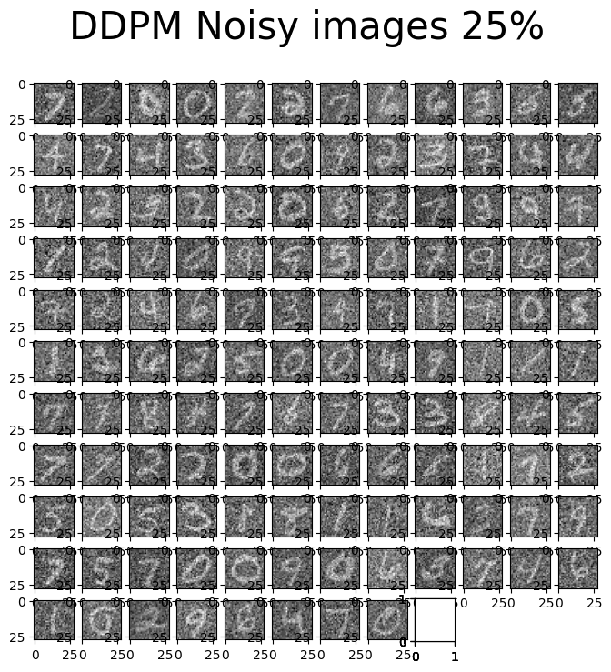
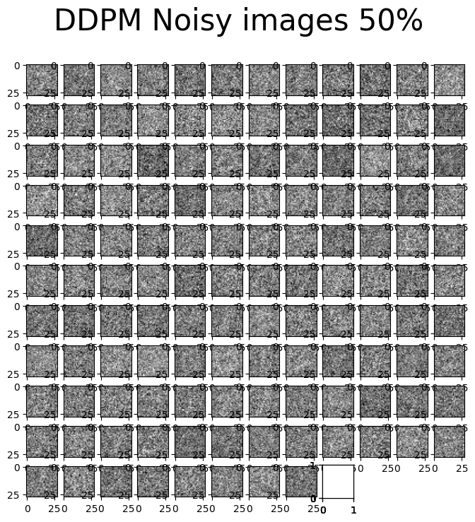
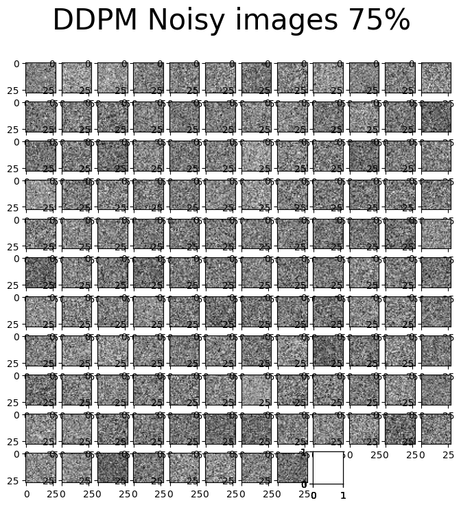
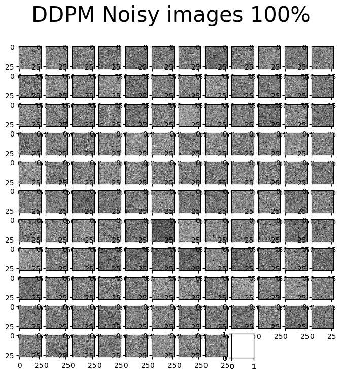
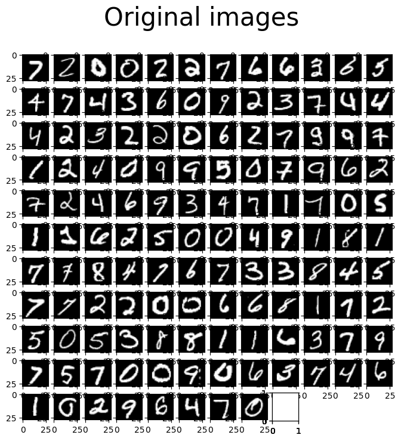

# Diffusion Models Project

## Overview

The `diffusion_models` project offers a cutting-edge Python implementation of Denoising Diffusion Probabilistic Models (DDPMs), a prominent class of machine learning models designed for generating high-quality data. By mastering the art of reversing the diffusion process, this project stands at the forefront of image generation and data augmentation technologies. Aimed at researchers, developers, and hobbyists alike, `diffusion_models` provides comprehensive tools for training, evaluating, and deploying diffusion models across various applications.

## Features

- **State-of-the-Art Generation**: Utilize DDPMs for creating detailed, high-quality images from noise.
- **Custom Architecture Support**: Includes a customizable U-Net-like architecture for versatile model design.
- **Advanced Conditioning**: Leverages sinusoidal positional embeddings for precise time-step conditioning.
- **Extensive Evaluation Toolkit**: Offers robust tools for model testing and performance assessment.
- **Diverse Application Potential**: Ideal for tasks ranging from image synthesis to sophisticated data augmentation.

## Visual Demonstrations

Observe the remarkable capability of DDPMs to transform noise into detailed images through these stages:

| Noise Level | Visualization |
|-------------|---------------|
| 25% Noise |  |
| 50% Noise |  |
| 75% Noise |  |
| 100% Noise |  |
| Original Images |  |

## Getting Started

## Usage
To run a diffusion model, use the following command:


## Acknowledgements

Special thanks to the original authors of the DDPM paper, [Ho et al.](https://arxiv.org/abs/2006.11239), for their groundbreaking work in the field. This project is inspired by their research and contributions to generative modeling.

### Installation

Clone the repository and install dependencies to get started with `diffusion_models`:

```bash
git clone https://github.com/chikap421/diffusion_models.git
cd diffusion_models
pip install -r requirements.txt
```

