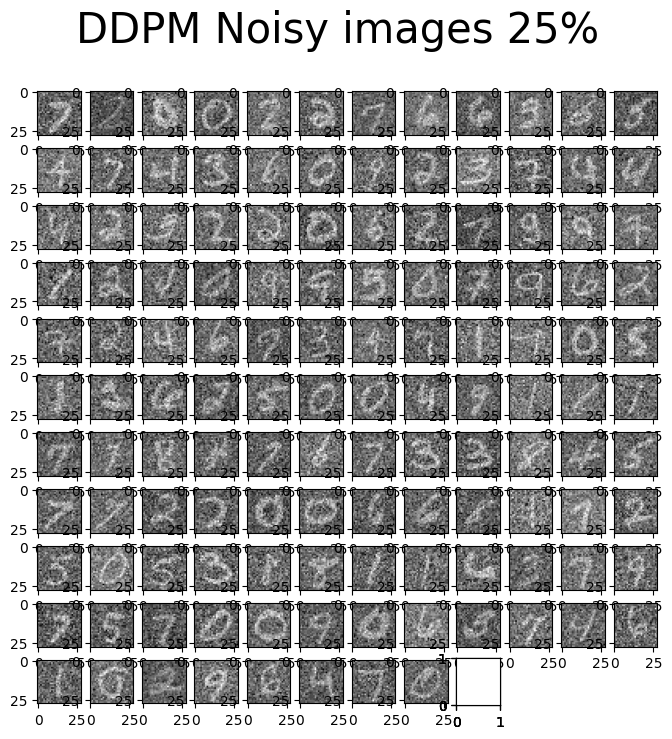
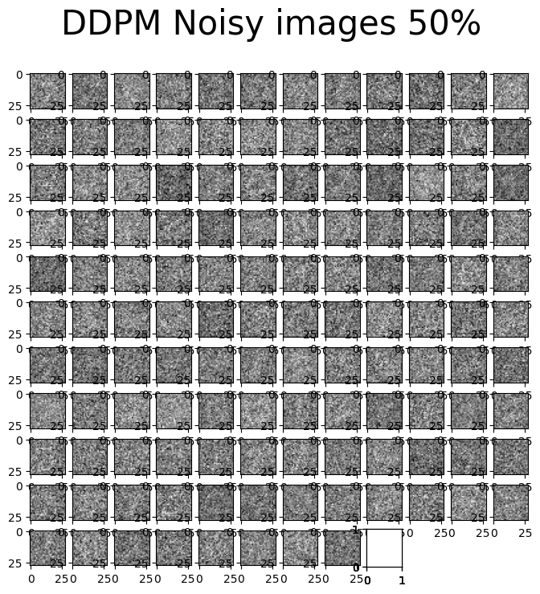
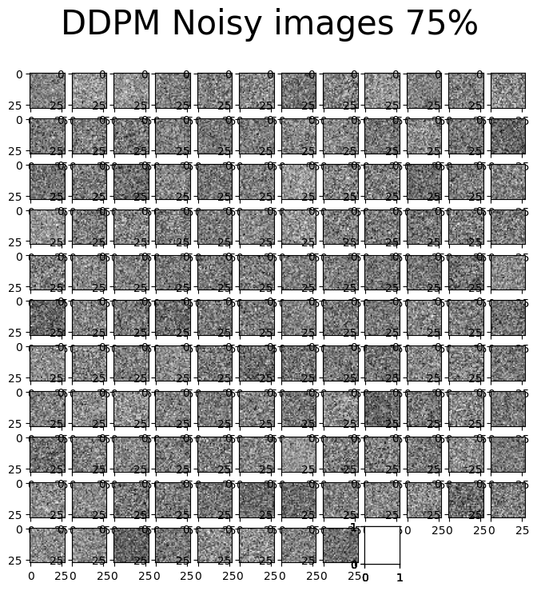
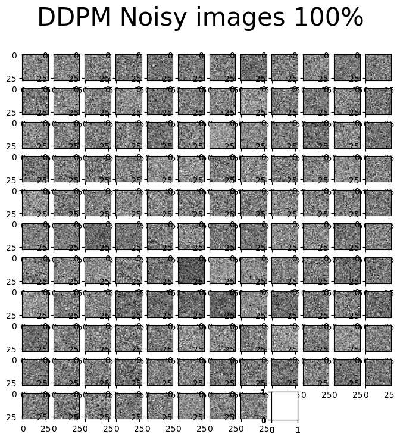

# Diffusion Models Project

## Description

`diffusion_models` is a state-of-the-art Python implementation of diffusion models, which are a class of machine learning models that generate high-quality data by learning to reverse a diffusion process. This project provides tools for training, evaluating, and using diffusion models for a variety of tasks such as image generation and data augmentation.

## Visuals

Here are some stages of noise addition to the images:

### 25% Noise


### 50% Noise


### 75% Noise


### 100% Noise


### Original Images


## Installation

To install `diffusion_models`, follow these steps:

```bash
git clone https://github.com/chikap421/diffusion_models.git
cd diffusion_models
pip install -r requirements.txt
```

## Usage
To run a diffusion model, use the following command:

```bash
python diffusion_models.py
```

